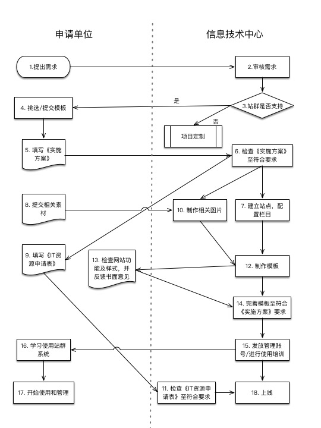

# 云南大学信息技术中心网站建设流程

## 概述
为规范站群网站建设流程，特制定此文档。
## 术语
### 申请单位
提出申请，需要制作网站的校内二级部门
### 执行方
指该阶段任务的执行方，可以是申请单位或信息技术中心相关岗位工作人员
### 进入标志
任务的进入标志，当满足要求时才能进入开始该任务。
### 任务内容
该任务需要进行或完成的工作。
### 完成标志
任务的完成标志，当满足要求时才能将当前任务标识为已完成。
### 工作量
完成某一工作所要求的时间，单位可以是小时或工作日。
## 建设流程
### 1. 提出申请
#### 执行方
申请单位
#### 进入标志
无
#### 任务内容
与信息技术中心运维中心联系，提出大概的网站建设需求。
#### 预计工作量
由申请单位决定
#### 任务完成标志
1. 与运维中心或信息技术中心网站建设负责人取得联系，提出网站建设的大致需求；
2. 形成书面网站功能需求文档并提交给信息技术中心网站建设负责人；
### 2. 审核需求
#### 执行方
信息技术中心
#### 进入标志
1. 完成【1. 提出需求】
#### 任务内容
- 判断申请单位提供的网站功能需求文档是否符合要求；
#### 预计工作量
1个工作日
#### 任务完成标志
- 网站功能需求文档符合要求
### 3. 判断站群是否支持
#### 执行方
信息技术中心
#### 进入标志
1. 完成 【2. 审核需求】
#### 任务内容
- 确认站群系统是否支持其功能需求
- 判断是否是定制项目
- 向申请单位展示可供挑选的模板
#### 预计工作量
2个小时
#### 任务完成标志
1. 确定站群系统是否支持网站功能需求；
2. 站群支持网站建设时：
    1. 提供给申请单位《实施方案》文件模板；
    2. 提供可使用的模板
3. 站群不支持网站建设时，流程结束。
### 4. 挑选/提交模板
#### 执行方
申请单位
#### 进入状态
1. 完成【3. 站群是否支持】
#### 任务内容
1. 根据提供的模板挑选一种用于网站建设，或自行制作静态网站模板
#### 预计工作量
由申请单位决定。
#### 任务完成标志
1. 确定所选模板，或完成静态页面的制作
备注：
1. 静态页面必须为HTML页面，必须是div+css的方式实现布局。
2. 静态页面至少应包括：首页、列表页、内容页三个页面。
### 5. 填写《实施方案》
#### 执行方
申请单位
#### 进入状态
1. 完成【4. 挑选/提交模板】
#### 任务内容
- 撰写《实施方案》
#### 预计工作量
由申请单位决定
#### 任务完成标志
1. 完成《实施方案》文档并提交给信息技术中心网站建设负责人。
2. 文档符合信息技术中心的要求。
### 6. 检查《实施方案》至符合要求
#### 执行方
信息技术中心
#### 进入状态
1. 完成【5. 填写《实施方案》】
#### 任务内容
1. 查看申请方提交的《实施方案》，栏目信息是否明确，修改部分是否清晰，是否在模板图上标注修改内容
2. 若是提供模板的，再次审核提交模板样式是否符合要求，《实施方案》中也要详细列出其栏目信息等
#### 预计工作量
1-2个工作日
#### 任务完成标志
1. 收下申请单位提供的《实施方案》并反馈收到信息或是反馈要求重新修改《实施方案》。
2. 对于提交模板的收下申请方提交的符合要求的模板文件及《实施方案》
### 7. 建立站点、配置栏目
#### 执行方
信息技术中心
#### 进入状态
1. 完成【6. 检查《实施方案》至符合要求】
#### 任务内容
1. 在站群系统上建立新站点；
2. 按照申请单位提交的《实施方案》建立栏目；
#### 预计工作量
1个工作日
#### 任务完成标志
1. 完成站点建立；
2. 新建栏目。
### 8. 提交相关素材
#### 执行方
申请单位
#### 进入状态
无
####  任务内容
1. 准备需要在网站上使用的相关素材及修改要求，并提交给信息技术中心网站建设负责人。
#### 预计工作量
由申请单位决定
#### 任务完成标志
1. 提交相关材料给信息技术中心
### 9. 填写《IT资源申请表》
#### 执行方
申请单位
#### 进入状态
1. 完成【6. 检查《实施方案》至符合要求】
#### 任务内容
- 填写《IT资源申请表》
#### 预计工作量
由申请单位决定
#### 任务完成标志
- 提交《IT资源申请表》，且符合要求
### 10. 制作相关图片
#### 执行方
信息技术中心
#### 进入状态
1. 完成【6. 检查《实施方案》至符合要求】
2. 完成【8. 提交相关素材】
#### 任务内容
- 根据收到的素材及制作要求，设计制作相关图片
#### 预计工作量
- 2个工作日
#### 任务完成标志
- 完成图片的制作，并提交给网站建设负责人
- 图片符合制作要求
### 11. 检查《IT资源申请表》至符合要求
#### 执行方
信息技术中心
#### 进入状态
1. 完成【9. 填写《IT资源申请表》】
#### 任务内容
- 检查收到的《IT资源申请表》是否符合要求，内容填写是否完整，是否有审核部门意见等。
#### 预计工作量
- 1个小时
#### 任务完成标志
1. 收到《IT资源申请表》
2. 《IT资源申请表》符合要求，或不符合要求时反馈申请单位修改。
### 12. 制作模板
#### 执行方
信息技术中心
#### 进入状态
1. 完成【7. 建立站点，配置栏目】
2. 完成【10. 制作相关图片】
#### 任务内容
- 根据收到的《实施方案》和制作好的相关图片素材，制作页面模板。
#### 预计工作量
每个页面2个工作日
#### 任务完成标志
1. 完成页面模板；
2. 反馈给申请单位临时在线浏览地址
### 13. 检查网站功能及样式
#### 执行方
申请单位
#### 进入状态
完成 【12. 制作模板】
#### 任务内容
- 检查网站的功能和样式，若有意见，书面反馈《修改意见》给信息技术中心网站建设负责人，《修改意见》的内容应当结合《实施方案》撰写。
- 无意见时需反馈“无意见”
#### 预计工作量
由申请单位决定
#### 任务完成标志
- 信息技术中心收到反馈信息
### 14. 完善模板
#### 执行方
信息技术中心
#### 进入状态
1. 完成【12. 制作模板】
2. 完成【14. 完善模板至符合《实施方案》要求】
#### 任务内容
- 根据《修改意见》并结合《实施方案》审查《修改意见》内容，对在《实施方案》范围内的内容进行网页修改及模板制作。
#### 预计工作量
2个工作日
#### 任务完成标志
- 完成《修改意见》提出的修改要求
### 15. 发放管理账号/进行使用培训
#### 执行方
信息技术中心和申请单位
#### 进入状态
1. 完成【14. 完善模板至符合《实施方案》要求】
#### 任务内容
- 新建站点管理员账号，并提交给申请单位；
- 发送《操作手册》给申请单位；
- 必要时，对申请单位网站（技术）负责人进行面对面培训。
#### 预计工作量
无需面对面培训时，1个工作日。
#### 任务完成标志
- 发送账号及《操作手册》给申请单位
- 完成面对面培训
### 16. 学习使用站群系统
#### 执行方
申请单位
#### 进入状态
1. 完成【15. 发放管理账号/进行使用培训】
#### 任务内容
- 根据收到的《操作手册》和登录账号信息对本单位的网站内容进行管理，登录系统后重新修改密码，保障本单位站点管理账号及密码的安全
#### 预计工作量
由申请单位决定
#### 任务完成标志
- 会对本单位站点内容进行维护
### 17. 开始使用和管理
#### 执行方
申请单位
#### 进入状态
完成【16. 学习使用站群系统】
#### 预计工作量
长期
#### 任务内容
- 对本单位网站长期进行管理和维护，实时更新内容
#### 任务完成标志
无
### 18. 上线
#### 执行方
信息技术中心
#### 进入状态
1. 完成【11. 检查《IT资源申请表》至符合要求】
2. 完成【15. 发放管理账号/进行使用培训】
#### 任务内容
- 配置发布服务器
- 修改DNS
- 必要时，修改学校主页上的链接地址
#### 预计工作量
2个小时
#### 任务完成标志
- 通过域名可打开网站
- 如果学校主页上有链接，通过主页上的链接可以打开网站。
