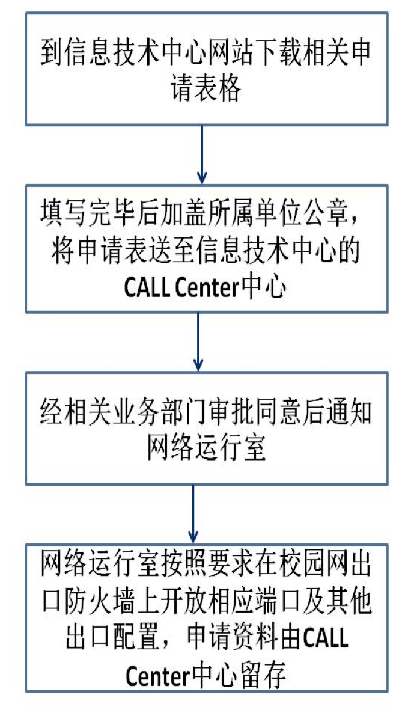

# 云南大学校园网出口防火墙安全管理制度

## 一、 目的 

规范校园网出口防火墙系统的管理，保障校园网出口防火墙系统的安全。

## 二、 适用范围 

本制度适用于校园网出口防火墙系统的建立、设置、操作、维护、监控、报警和处理过程。

## 三、 管理规定

### （一）、职责定义

出口防火墙管理员：负责防火墙系统具体的方案设计、参数配置、维护、日常运作工作，以及负责防火墙系统的每周日志收集和统计。负责防火墙系统安全标准的制订、修改和审计、日志分析工作。负责制订防火墙系统的总体策略和需求。

### （二）、系统管理

1、 严禁私自安装、更改、拆离防火墙。

2、 出口防火墙管理员必须定时对防火墙的物理连通性、流量大小、CPU利用率、安全规则的有效性等各种指标进行监控，发现问题及时上报处理 。

3、出口防火墙管理员必须整理和维护配置语句解释文档，解释文档必须准确。

 4、出口防火墙管理员必须定期与相关业务部门联系，整理和维护登记使用的Internet和DMZ区地址文档 。

 5、出口防火墙管理员必须定期分析防火墙日志，发现问题及时上报解决  。

6、出口防火墙管理员发现安全问题后，对有明确处理方式的问题按规定处理，对其他问题必须立即向中心领导和网络运行室领导报告，然后再决定处理方式 。

7、 当防火墙的配置改变时，必须及时备份配置文件。

### （三）、防火墙配置原则 

1、防火墙上的访问通道遵循“由内到外，允许校内所有主机访问Internet；由外到内，缺省全部关闭，按需求开通的原则”，拒绝开启除明确许可的任何一种服务。 

2、防火墙必须进行安全日志记录。 

3. 不允许从Internet访问学校内部除DMZ区的机器外的任何网络，但允许校内所有主机访问Internet。 

4、防火墙的配置更改应该依照流程申请、审批、执行。

 5、严格限制具有防火墙管理权限的人员数量。

 6、防火墙的安全日志要每天记录和每周分析。

 7、防火墙应该开通对登陆到其上的用户认证、授权、审计的功能，保证用户的活动有记录。 

8、所有和外部网络有连接的内部网络上的系统必须经过防火墙的保护 

9、防火墙的登录密码必须有足够的健壮性，并且建立定期更新的制度 。

10、防火墙启动VPN功能时，必须加密和认证。 

11、防火墙的配置和相关的系统设计信息（如：网络拓扑结构）严禁泄露。

 12、防火墙应及时升级，防火墙必须配置成能防止已知的各种攻击方式，如：tear-drop、syn-attack、ip-spoofing、ping-of-death、src-rout、land、icmp-flood、udp-flood、port-scan、addr-sweep、default-deny 、DOS攻击等。

13、防火墙的外部接口必须关闭不必要服务，限制Ping 、sp等各种可管理协议，严格限制可登陆到防火墙上进行配置活动的IP地址范围。

14、 用户3次登陆防火墙失败，对该用户锁定。

### （四）、用户策略开通原则       

1、防火墙所有的用户策略开通原则上由用户通过其上级领导同意，信息技术中心相关业务部门审核确认后方可开通。 

2、用户策略必须明确申请人、使用目的、使用时限、需要开通的端口等，达不到以上要求的，不予以开通。 

3、防火墙系统管理员有权利拒绝用户不安全的策略申请。

## 四、 本制度归云南大学信息技术中心解释。

## 五、  本制度从2016年1月起实施。

 

信息技术中心

2016年1月

## 附录 云南大学校园网防火墙及出口开放申请流程

