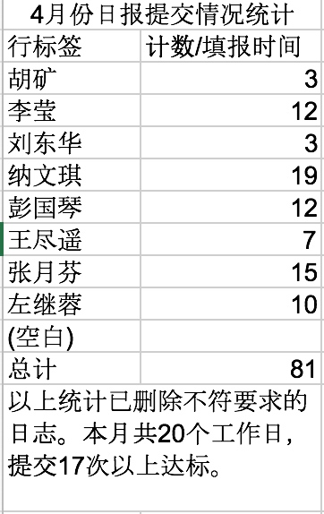

# 2017年4月工作汇报
汇报周期：4月16日至5月15日

## 项目建设&研发

1. 学工系统：
    1. 完成就业系统需求调研、就业网站需求变更修改工作；
    2. 实施就业网新老系统切换工作，就业系统上线前培训准备工作;
    3. 完成校友系统需求调研工作；
    4. 完成学工系统伍达观助学金申请业务。
    5. 宿管系统安排试运行，试运行期间相关问题答疑

    
2. 研究生系统：
    1. 完成研工系统奖学金、助学金需求调研，梳理需求制定后续工作安排；
    2. 完成研究生系统档案需求调研、demo制作,培养方案数据清洗完毕；

    
3. 一卡通建设：
    1. 一卡通系统维护和新增一卡通数据413条，包括经济学院、文学院、实验室与设备管理处、资产管理处、后勤服务集团等单位部门及个人，涉及金额2262元；
    2. 共处理一卡通申请50余份，共发卡制卡411张，其中包括由本部及呈贡卡点制卡发卡126张（涉及金额1386元）；
    3. 处理一卡通app密码问题1个；
    4. 测试一卡通app扫码支付；
    5. 完成一卡通banner设计6个；
    6. 处理学生被盗刷流水信息问题1个，处理研究生院老师一卡通数据错误问题1个；

    
4. 统一身份认证系统。
    1. 继续推进elearning、站群的统一身份认证改造；
    2. 联系深澜和金智，开始认证系统SSO改造，但深澜方面有疑问，现已暂停；
    3. 导入了留学生信息
    4. 完成两个文档：[《统一身份认证应用授权说明》](../../../gzlc/a3/yingyong-shouquan.md)、[《统一身份认证系统管理办法》](../../../gzlc/a3/imp-guanli-banfa.md)

    
5. 站群升级：
    1. 继续推进站群迁移工作，已完成一个网站完全迁移；

## 应用系统管理

1. 邮件系统
    1. 本月新开邮件帐号、解锁、修改邮箱配置、重置邮箱密码、解锁：29人/次；
    2. 邮件系统安全管理：通过邮件网关、邮件收发及删除日志，调整IP黑名单140条、过滤规则3条；
    3. 完成邮件系统切换

2. 网络教学平台：
    1. 处理用户密码邮件6例，呼叫中心转用户密码问题3人次，回复学生关于登录问题的咨询邮件15封，教师咨询邮件2封；回复教师登录咨询电话6人次，处理接入统一身份认证后的新增用户需求2人次，处理教师关于测验的问题2人次。
    2. 完成系统接入统一身份认证的工作，现已测试成功，开始正式使用，在校园网首页发布通知。处理了登录后无法退出的bug，以及不包含在统一身份认证中的特殊用户登录问题等，解决了教师特殊使用需求，并通知相关教师。

    
3. 站群系统：
    1. 维护站点18站次

    
4. 云南大学慕课平台：
    1. 老师团队完成了学堂在线视频观看进度查询的小程序，通知各门课程的学生网站地址。

    
5. 认证系统：编写《eduroam服务管理办法》及开通通知

## 数据中心

1. 负载均衡：
    1. 处理LB问题4个；
2. 服务器：
    1. 安排浪潮公司服务器巡检，并发现服务器风扇故障；
3. 完成中心预算中数据中心相关内容建设项目申报；
4. 完成数据中心存储巡检工作4次

## 外联&事务
1. 网络安全
    1. 完成全国公安机关互联网站安全服务平台备案；
    2. 完成公安厅、教育厅和网信办工作联络，信息报送8次；
    3. 参加云南省第三届网络安全等级保护技术大会；
    4. 完成教育行业漏洞报告平台例行查看，处理信息系统漏洞5次；
    5. 完成信息系统安全等级备案表、报告等相关材料的准备和保送；
    6. 梳理域名备案等情况;
    7. 完成教育网NOC网络安全报告；

2. 教学工作
    1. 完成4门课程的教学任务；
    2. 完成以“雨课堂的应用”为主题的业务学习，并与中心各位任课教师讨论雨课堂工具的推广使用，总结使用效果。

3. 学校主页
    1. 主页发布公告40条
    2. 维护固定内容4条

    
4. 完成IT资源申请表2份

5. 完成综合楼大厅及三楼空间改造在设计；

## 日报提交情况

## 月报提交情况
本月应收月报11份，实收9份。

