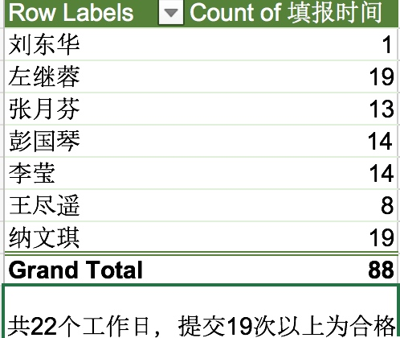

# 2017年6月信息资源部月报（5月16日-6月15日）

## 项目建设&研发

1. 完成一卡通系统A\B\C三个包的终验；完成研究生系统、三大平台、慕课等项目的验收；
2. 完成一卡通移动支付功能上线；
3. 开始云大主页改版工作；
4. 完成就业系统上线及培训工作；
5. 完成研工系统奖学金、助学金需求调研，demo 制作，制定后续工作安排；
6. 完成研究生系统档案需求调研、demo制作,培养方案数据清洗完毕，配合王锐处理学籍需求；
7. 完成研招需求调研，目录编制安排测试工作；
8. 完成离校系统上线、数据清洗等工作了；
9. 完成站群系统使用培训；
10. 启动学校网站迁移工作，已完成20余个；
11. 开始“IT资源管理系统”研发；

## 应用系统管理

1. 认证计费系统：
    1. 处理学生及外聘人员账号到期问题636人次；
    2. 完成上网帐户开户22单。
2. 统一身份认证系统
	1. 修改统一身份认证密码6人次
3. 邮件系统
    1. 新开邮件帐号26个；
    2. 重置密码121个；
    3. 删除到期用户8284个
4. 网络教学平台：
    1. 共处理用户密码邮件3例
    2. 解决教师课程权限问题1人次
    3. 解决教师课程信息问题1人次。
5. 一卡通系统：
    1. 维护、新增一卡通数据556条，共涉及金额5988元；
    2. 卡信息更新153张；
    3. 卡补办6张，挂失处理3个
    4. 共处理一卡通申请50余份；
    5. 共发卡制卡556张；
    6. 处理一卡通app密码问题1个
6. 通元站群系统：
    1. 维护站点4个

## 数据中心

1.  LB配置域名56个；
2. 完成数据中心存储巡检工作4次（每周一），并保存相关巡检日志，发现华为存储报警2次，已经处理完毕；
3. 2人参与宏杉MSTE培训一周；
4. 完成中心预算中数据中心相关内容建设项目申报表；
5. 更换数据中心FC交换机故障电源模块；
6. 更换HBA卡一次，更换FC模块一次；

## 外联&事务

1. 制作《云南大学网络与信息安全责任书》
2. 审批IT资源申请表1份
3. 网络安全：
    1. 完成教育厅发来的信息系统漏洞处理4次；
    2. 完成公安厅发来的信息系统漏洞处理1次；
    3. 完成公安厅、教育厅和网信办工作联络，信息报送3次；

4. 教学秘书工作：
    1. 传达教务处关于课堂行为的通知，告知各任课教师教务处七条禁令，收到教务处考试改革方案批复意见。
    2. 上报教务处关于下学期慕课课程开设事宜。
    3. 统计各位任课教师课程教学工作量。
    4. 学生选课前准备，联系教务处修改慕课课程备注。
    5. 做好各门课程期末考试准备，衔接考试时间及地点，落实考试注意事项，包括开卷考试注意事项等，通知各任课教师。
5. 云大主页
    1. 发布公告12条
    2. 维护固定内容3处

## 日报提交情况

## 月报提交情况

应收月报11份，实收9份。

