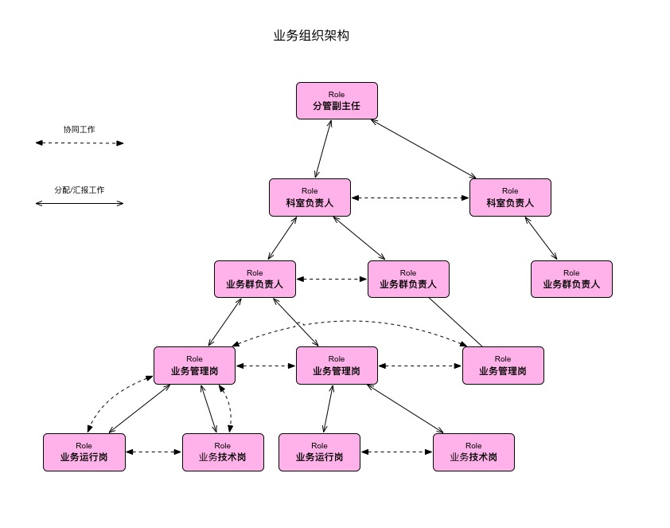

# 业务组织架构

## 架构设计原则
1. 避免岗位之间过多进行工作协调。合理设置岗位，尽量将一个岗位的工作内容中可能需要协调的其他岗位控制在3-5个以内；
2. 工作分配有据可循。逐步完善各岗位的工作内容，当有新任务或临时工作时，按照岗位工作内容分配工作；
3. 按岗位理清工作职责。每个岗位有且仅应当有一个工作人员，以便落实工作职责。
4.

## 业务组织架构图

## 架构说明

1. 组织架构分为科室、业务群、业务、业务岗位四级。
2. 科室设一个负责人岗位，负责：
    - 管理科室工作；
    - 最终确定科室内各岗位的设置和工作内容；
    - 将上级领导安排的工作分解并安排给各业务群；
    - 向分管副主任汇报科室工作情况；
    - 与其他科室协同工作。
3. 在科室内，按照工作性质，以尽量减少协作为目标将所有工作被划分为数个业务群。
4. 每个业务群设一个业务群负责人岗位，负责：
    - 管理业务群的工作；
    - 将科室负责人分配的工作分解并安排给业务负责人；
    - 向科室负责人汇报业务群工作情况；
    - 与科室内其他业务群负责人协同工作；
5. 在业务群内，以尽量减少协作为目标将所有工作划分为数个业务。
6. 每个业务设一个管理岗，并按工作内容设置多个其他工作岗位（例如运行岗、技术岗等）。
7. 业务管理岗负责：
    - 全面管理业务工作；
    - 将业务群负责人分配的工作分解并安排给相关岗位；
    - 向业务群负责人汇报业务工作；
    - 与业务内各岗位协同工作；
    - 与科室内其他业务负责人协同工作；
8. 业务内其他岗位的工作职责：
    - 完成本岗位的工作；
    - 与业务内其他岗位协同工作；
9. 当科室负责人（业务群负责人/业务管理岗）之间工作无法协调时，应由上一级负责人进行协调。

## 补充说明

1. 汇报工作。除《信息室工作汇报制度》的要求外，工作汇报仅需在需要的时候进行。
